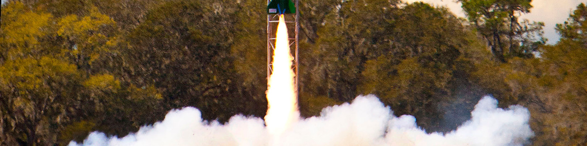

**👋 Hello!**

I'm a software engineer working on the Planning & Tracking team right here at GitHub :octocat:, building the [new GitHub Issues](https://github.com/features/issues).

I mostly focus on front-end web development (in vanilla JS, TypeScript, React, and Angular) but I've also done server-side work (in Java and Scala), [Windows applications](https://github.com/iansan5653/open-mcr), desktop software plugins, and even embedded systems.

I graduated from USF in 2020 with a degree in mechanical engineering, where I spent way too much time [building rockets](https://instagram.com/usfsoar) 🚀.

In my free time I race sailboats in Tampa Bay ⛵.

---

:speech_balloon: You can get in touch with me by [starting a new discussion](https://github.com/iansan5653/iansan5653/discussions/new) on my profile repo or by [sending me an email](mailto:iansan5653@gmail.com).
